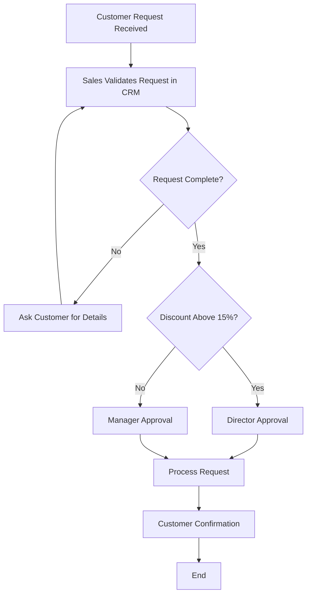

# Business Process Flow — Customer Request Handling (AS-IS)

This flow reflects the process as described in the meeting, including the
approval and discount sign-off steps discussed.

Missing or unclear steps may require human review before this is finalized.
