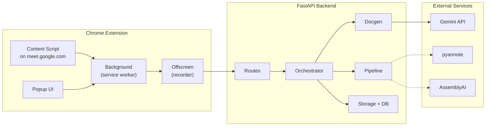
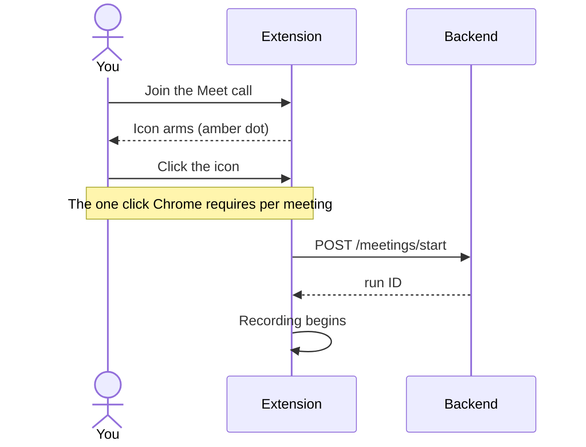
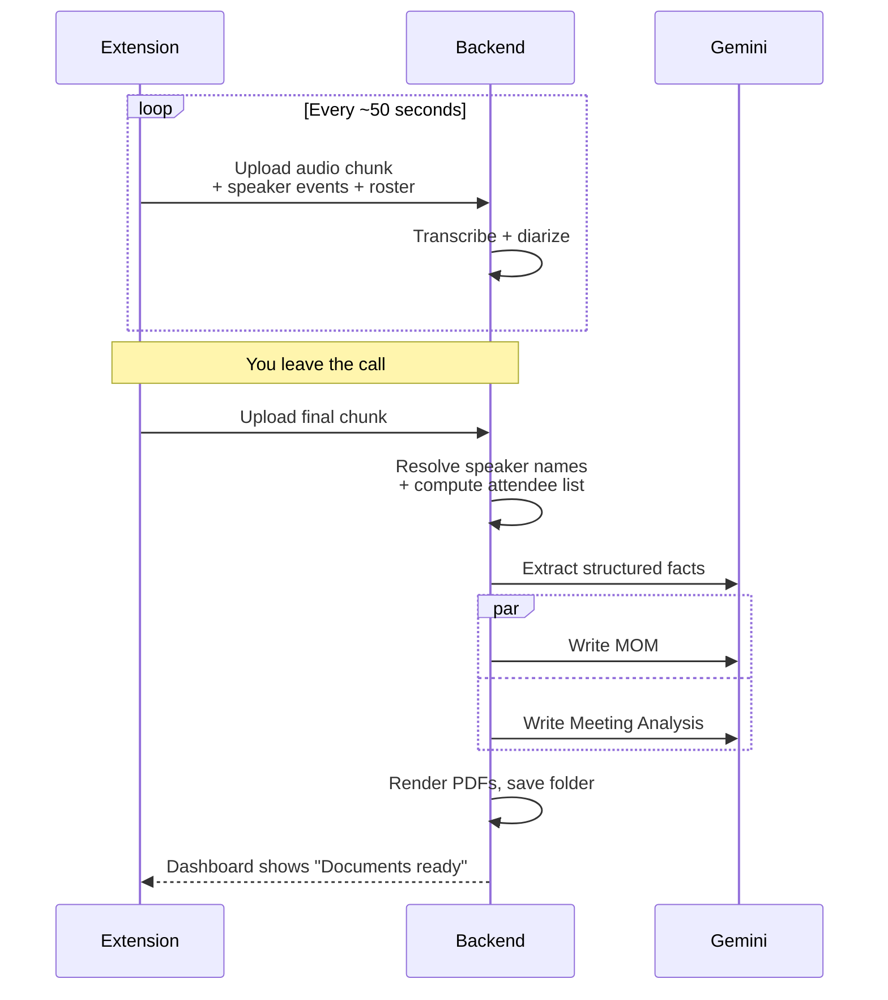
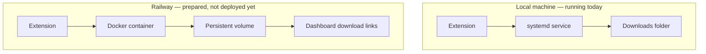

# Meeting Saathi — Architecture Reference

A complete, start-to-end reference: what's built, how the pieces fit
together, and what a regular user actually experiences when they install
and use it. This is deliberately more detailed than `docs/ARCHITECTURE.md`
(a short technical index for developers) — this doc is meant to be read
top to bottom by anyone, technical or not, who wants the full picture.

## 1. What it is, in one paragraph

Meeting Saathi is a Chrome extension + local web service that joins a
Google Meet call, records it, and automatically produces two documents
after the call ends: a **Minutes of Meeting (MOM)** and a **Meeting
Analysis** (a plain-English "what happened / what needs to be done"
summary). Recording, transcription, and speaker identification all happen
without the user doing anything beyond one click at the start of each
call; the documents are written by Google's Gemini API, grounded strictly
in what was actually said.

## 2. Component architecture

Three independent pieces:

- **The Chrome extension** — runs entirely on the user's machine, has no
  server-side component of its own. Its only job is to capture audio and
  upload it.
- **The FastAPI backend** — receives the audio, transcribes it, figures
  out who said what, and asks Gemini to write the documents.
- **External services** — Gemini (always used), and either local
  `pyannote.audio` or optional paid AssemblyAI for diarization when
  needed (see §4).

### Extension, file by file

| File | Runs where | Job |
|---|---|---|
| `content_script.js` | Injected into `meet.google.com` | Detects when a call actually starts/ends (several independent DOM signals, since Meet's markup isn't a stable API); scrapes the "who's speaking" tile and the People panel roster; shows in-page status banners. |
| `background.js` | MV3 service worker | The coordination hub. Arms/disarms recording, calls `/meetings/start`, tells the offscreen document to start/stop, relays speaker/roster events. State lives in `chrome.storage.session`, not plain variables — Chrome kills and restarts this script after ~30s idle, and plain variables would be wiped. |
| `offscreen.js` | Hidden offscreen document | The only context allowed to touch `MediaRecorder`/`getUserMedia`. Mixes tab audio and microphone into one stream, cycles the recorder every ~50s into independently-uploadable chunks, uploads each with a snapshot of speaker events + roster. |
| `popup.html` / `popup.js` | Toolbar popup | Start/Stop button, one-time microphone-permission flow, and the Setup section (name + server URL) for multi-user sharing. |

### Backend, module by module

| Module | Job |
|---|---|
| `app/main.py` | Every HTTP route: dashboard, the chunk-upload trio, cancel, and the file-download route. CORS is wide open since the extension calls in from a `chrome-extension://` origin. |
| `app/orchestrator_streaming.py` | The pipeline the extension actually drives: accepts chunks as they arrive, diarizes each one, and on the final chunk assembles the transcript and runs document generation. |
| `app/orchestrator.py` | The older whole-file-upload sibling, kept as a manual/testing fallback for `POST /meetings/upload` — not the path real meetings use anymore. |
| `app/pipeline/diarize.py` | "Who said what." DOM-primary: if Meet's own speaking-tile events cover enough of a chunk, no audio ML is needed at all. Otherwise falls back to local `pyannote`, or AssemblyAI if a key is configured. |
| `app/pipeline/speaker_names.py` | Turns diarization's generic "Speaker 1/2/3" labels into real names using the DOM speaker-event timeline (majority vote per cluster). Guarantees no bare placeholder ever reaches a document — anything left over becomes `"Unidentified speaker N"` with a transcript excerpt attached. |
| `app/pipeline/roster.py` | Combines the People-panel roster with confidently-named speakers into one deterministic attendee list — the only signal that can see someone who joined but never spoke. |
| `app/docgen/engine.py` | The two-call Gemini pattern: extract structured facts first, then write MOM and Meeting Analysis concurrently, each grounded only in those facts plus the transcript. |
| `app/storage.py` + `app/db.py` | Atomically writes a meeting's files into a named folder, and a small SQLite table (`meeting_runs`) tracking every run's state, owner, and result. |

## 3. Recording → document, end to end

The recording is never uploaded as one big file at the end — it streams
up in ~50-second chunks *while the call is still happening*, so by the
time the meeting ends, most of the transcript is already processed. Split
into two diagrams below on purpose (start, then during/end) — one combined
diagram was too dense to read comfortably.

### Starting a recording

The one click is a hard Chrome rule, not a design choice: `tabCapture`
only starts in direct response to the user invoking the extension itself
(a toolbar click, a keyboard shortcut, or a context-menu item) — a button
injected into the page by the content script does **not** qualify. This
is why the in-page banner can only ever say "click the icon," never offer
its own clickable button.

### During the call, and after you leave

**Why speaker names are usually right without any audio ML:** Google Meet
visually highlights whoever is currently speaking. The content script
watches for that and reports timestamped "X is speaking" events to the
backend alongside the audio. If those events cover enough of a chunk's
timespan, the backend trusts them directly and skips pyannote/AssemblyAI
entirely for that chunk — the common case in a normal multi-person call,
free and fast. Only when coverage is too sparse (screen-share, a solo
call, off-screen tiles) does it fall back to real diarization.

## 4. Multi-user sharing

Added so the tool could be handed to BA testers and, now, a small group of
end customers — without any one person burning the whole shared Gemini
quota, and with a way to actually see who's using it.

- **Identity, without a login.** Each person types their name once in the
  extension's Setup section (`extension/popup.html`). It's stored locally
  in `chrome.storage.local` and sent as `user_name` on every
  `POST /meetings/start` — no password, no account.
- **A daily cap, enforced server-side.** `app/main.py`'s `/meetings/start`
  checks `db.count_runs_today(user_name)` against
  `settings.daily_meeting_limit` (default 3) before creating a run. Over
  the limit, the request is refused with `429 daily_limit_reached` and a
  plain message — the recording never starts, rather than starting and
  failing later.
- **A visible usage table.** The dashboard's "Usage by person" section
  (`db.usage_summary()`) shows every name, today's count, total count, and
  last-active time.

## 5. Deployment: where the backend actually runs

| | Local (today) | Railway (prepared) |
|---|---|---|
| Runs on | The user's own machine, via `meeting-saathi.service` (systemd) | A Docker container on railway.com |
| Reachable at | `http://localhost:8420` | A public `https://*.up.railway.app` URL |
| Documents land in | `~/Downloads/Meeting Saathi/<title> - <date>/`, directly on disk | A mounted persistent Volume, retrieved via `GET /meetings/{id}/files/{filename}` download links on the dashboard |
| Status | Actually running | Docker image builds and smoke-tests successfully; not yet deployed to a real railway.com project (needs the user's own account/billing) |

The download route didn't exist before this deployment work — on a local
machine, the user just opens their own Downloads folder, but a remote
server has no "the user's folder" concept, so the dashboard needed a real
way to hand back the finished files.

## 6. For a regular user: install, permissions, day-to-day use

### Installing the extension

1. Open `chrome://extensions`.
2. Turn on **Developer mode** (top-right toggle).
3. Click **Load unpacked** and select the `extension/` folder.

### What each permission is for

| Permission | Why it's needed |
|---|---|
| `tabCapture` | Lets the extension record the Meet tab's audio. |
| `offscreen` | MV3 service workers can't run `MediaRecorder`/`getUserMedia` directly — this lets the extension open a hidden document that can. |
| `storage` | Remembers your name, server URL, and current recording state across the popup opening/closing and the service worker restarting. |
| `activeTab` | Knows which tab you clicked the extension icon on. |
| `notifications` | Shows a system notification if something fails (upload error, recording couldn't start) so it isn't missed mid-meeting. |
| `host_permissions` (`meet.google.com`, the backend URL, `*.up.railway.app`) | The exact sites/servers the extension is allowed to talk to — `meet.google.com` for the content script, and the backend URL(s) for uploading recordings. |

### One-time setup

- **Microphone access**: the first time, the popup shows a red "Enable
  Microphone Access" section — click it once. Without this, only other
  participants' audio gets recorded, not the user's own voice.
- **Name + server URL**: open the popup's "Setup" section, type a name
  (used only for the daily limit and the usage table — no password), and
  the server URL if not using the default `localhost:8420`.

### Using it

1. Join a Google Meet call. The extension icon turns amber (armed) and an
   in-page banner reminds "click the icon to start recording."
2. Click the icon once — this is the one click Chrome requires per
   meeting (see §3). Recording starts automatically from here.
3. Everything else is automatic: audio uploads in the background while
   the call continues, and stops on its own when the user leaves the call
   or closes the tab.
4. After leaving, the backend finishes processing (usually well under a
   minute, since most of the transcript was already done during the
   call) and the dashboard shows "Documents ready."

### Where the documents end up

- **Local deployment**: `~/Downloads/Meeting Saathi/<Meeting Title> -
  <date>/`, containing `MOM.pdf`, `MOM.md`, `Meeting_Analysis.pdf`,
  `Meeting_Analysis.md`, `transcript.txt`, `transcript.json`.
- **Railway deployment**: the same six files, retrieved via download links
  on the web dashboard instead of a local folder (see §5).

## 7. Tech stack

| Layer | Technology | Version (from `requirements.txt` / `manifest.json`) |
|---|---|---|
| Backend framework | FastAPI + Uvicorn | 0.115.6 / 0.34.0 |
| Database | SQLite (via Python's built-in `sqlite3`) | — |
| Speech-to-text | faster-whisper | 1.2.1 |
| Diarization | pyannote.audio | 4.0.7 |
| Diarization (optional, paid) | AssemblyAI | 0.64.33 |
| Document writing | Google Gemini API (`google-genai`) | 2.16.0 |
| PDF rendering | Playwright (headless Chromium) | 1.49.1 |
| Browser extension | Chrome Manifest V3 | — |
| Templates | Jinja2 | 3.1.5 |

## 8. Current status — honestly

- ✅ **Verified**: the full chunked recording → transcription → diarization
  → document-generation → save pipeline; the multi-user daily-limit and
  usage-tracking feature (unit-tested); the Railway Docker image (builds
  and smoke-tests successfully locally).
- ⚠️ **Implemented but not yet confirmed on a real live call**: the
  speaker-name/attendee-count fix from an earlier session is unit-tested
  but hasn't been verified end-to-end against an actual multi-person
  Google Meet call yet.
- 🚫 **Not done**: actually deploying to railway.com (needs the user's own
  account); the Gemini API key is very likely still on the free tier
  (~20 requests/day), which will not sustain real multi-customer usage —
  this needs upgrading before showing the tool to paying customers at any
  real scale.
- 💤 **Dormant, not deleted**: a Requirement Gathering Sheet and Action
  Points generator both still exist in `app/docgen/generate_prompt.py`
  but are not currently called from `engine.py::generate_documents()` —
  turned off to save Gemini quota while testing with a small group, not
  because they don't work.
